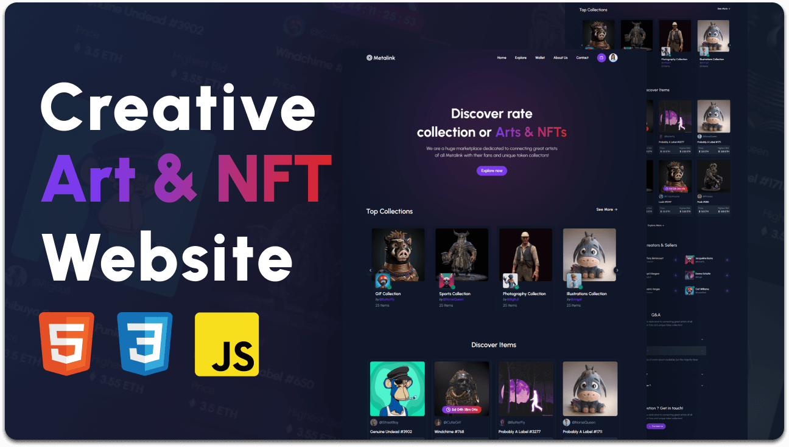

# MetaLink 🎮🔗🖼️

Welcome to **MetaLink**, a cutting-edge website combining the worlds of gaming and NFTs, created with HTML, CSS, and JavaScript. This repository contains the source code for the MetaLink website, designed to provide a seamless and engaging experience for gaming and NFT enthusiasts.



## Description

**MetaLink** is your ultimate destination for discovering and exploring the latest in gaming and NFT (Non-Fungible Token) events and collections. Whether you're a gamer looking to stay updated with the latest events or an NFT collector seeking new additions, MetaLink offers a sleek and interactive platform to meet your needs. Built with modern web technologies, this project emphasizes responsiveness and interactivity, ensuring a smooth experience across all devices.

## Table of Contents 📚

- [Demo](#demo-🔗)
- [Features](#features-⭐)
- [Installation](#installation-💾)
- [Usage](#usage-🚀)
- [Contributing](#contributing-🤝)
- [License](#license-📜)

## Demo 🔗

Check out the live demo of the website here: [MetaLink Live Demo](https://krypto-etox.github.io/MetaLink/)

## Features ⭐

- **Responsive Design:** 📱💻 The website is fully responsive and looks great on all devices, from desktop to mobile.
- **Interactive UI:** 🎨 Smooth animations and interactive elements enhance the user experience.
- **Gaming Events:** 🎮 A dedicated section to list and explore upcoming gaming events.
- **NFT Collections:** 🖼️ Showcase and discover the latest NFT collections.
- **Easy Navigation:** 🧭 Intuitive navigation to help users find information quickly.

## Installation 💾

To get a local copy up and running, follow these simple steps:

1. **Clone the repository:**
   ```bash
   git clone https://github.com/krypto-etox/MetaLink.git
   ```

2. **Navigate to the project directory:**
   ```bash
   cd MetaLink
   ```

3. **Open `index.html` in your browser:**
   You can simply double-click the `index.html` file or open it through your preferred web server setup.

## Usage 🚀

- Open the `index.html` file in any web browser to view the website.
- Modify the HTML, CSS, and JavaScript files to customize the website according to your needs.

## Contributing 🤝

Contributions are welcome! Please follow these steps:

1. Fork the repository.
2. Create a new branch: `git checkout -b feature/YourFeature`
3. Commit your changes: `git commit -m 'Add some feature'`
4. Push to the branch: `git push origin feature/YourFeature`
5. Open a pull request.

## License 📜

Distributed under the MIT License. See `LICENSE` for more information.

---

Feel free to explore, modify, and enhance the project. Happy coding! If you have any questions or suggestions, please open an issue or contact us directly.

---


